# Customer Clustering Analysis
## Executive Summary
This project aimed to segment customers based on behavior and transaction patterns using data from the Transaction Data, Customer Data, and BLS Statistics. Through data cleaning, normalization, and analysis utilizing K-Means, HDBSCAN, and OPTICS algorithms, we sought to uncover distinct customer groups. The analysis revealed that while K-Means suggested a simplistic bifurcation of the customer base, OPTICS provided a nuanced segmentation with 25 clusters, balancing detail and interpretability.

The chosen OPTICS model outperformed others in terms of visualization and cluster reasonability, despite K-Means scoring higher on initial metrics. The comprehensive analysis highlighted the importance of demographic and transactional features in customer behavior patterns, guiding the segmentation process.

Future efforts will concentrate on advancing feature engineering and model optimization to enhance customer segmentation. This will involve deeper transactional analysis and possibly integrating ensemble methods to refine the clustering approach and support strategic business decisions.

## Background
The main objective was to analyze customer behavior and transaction patterns to effectively segment customers, leveraging both demographic data and transaction details.

## Data Source
1. **Transaction Data**: Consists of transaction amounts, timestamps, customer IDs, and transaction types.
2. **Customer Data**: Provides demographic information, including age, gender, profession, work experience, and family size.
3. **BLS Statistics**: Features the Annual Median Wages data from the U.S. Bureau of Labor Statistics.

## Data Pipeline Creation
The initial task involved establishing a data pipeline to import data from provided CSV and Excel files into a SQL database, utilizing Python and MySQL. The process, detailed in the [database_creation.ipynb](/src/database_creation.ipynb) notebook, comprised the following steps:

1. **Database Creation and Initialization**: Utilized `mysql.connector` for database setup and `pandas` for table creation.
   
2. **Data Extraction**: Employed `pandas` to extract data from CSV and Excel files.
   
3. **Data Transformation**: Ensured data consistency and integrity by checking for missing values, duplicates, and appropriate data types. Special characters in the BLS data were addressed according to their field descriptions, with transformations applied as necessary.

4. **Combine Customer and BLS Data**: Merged customer and BLS data on the `OCC_CODE` column using `pandas`, then loaded the merged data into the SQL database.
   
5. **Data Loading and Relationship Creation**: Imported data into SQL tables and established table relationships with foreign keys.
   
6. **Data Validation**: Confirmed data accuracy and table integrity post-load.

## Stored Procedure Development
Developed a stored procedure to calculate transaction averages and counts by type per customer. A trigger was set up to activate this procedure upon new transaction entries. The implementation was done in MySQL and Python, with relevant code in the [stored_procedure.ipynb](src/stored_procedure.ipynb) and [.sql](src/stored_procedure.sql) files.

## Customer Segmentation
The final task focused on clustering analysis for customer segmentation, employing K-Means, HDBSCAN, and OPTICS algorithms. This involved data preparation, exploratory analysis, and cluster evaluation. The process is documented in the [customer_segmentation.ipynb](src/customer_segementation.ipynb) notebook.


### Clustering Analysis Results
#### Data Cleaning and Preprocessing
* **Combining Data for Comprehensive Analysis**

  To capture a more accurate customer behavior pattern, we combined customer data, BLS statistics, and a 30-Day Lookback Average of transaction data. Unlike the account profile table, which only offers a simple aggregation by `customer_id`, this combined approach provides a dynamic view of transaction patterns. We calculated the average and count of transactions over a 30-day period for each customer, then grouped by `customer_id` to form a unique pattern profile per customer. This method yields a more nuanced reflection of customer behavior compared to the static account profile table. Additionally, we matched the `Profession_Code` in the customer data with the `OCC_CODE` in the BLS data to append the annual median wage for each customer, forming a robust dataset for subsequent clustering analysis.

* **Data Integrity Checks**

  We found no missing values in the `customer` table. However, the `lbp_tx` table showed notable missing data, particularly in the average transaction type, which we imputed with a placeholder value of $-1$.

  In the `bls` table, columns like `JOBS_1000`, `LOC_QUOTIENT`, `PCT_TOTAL`, and `PCT_RPT` were entirely missing and thus excluded from analysis. The `ANNUAL` and `HOURLY` columns, intended to be boolean, had missing values that were corrected to $False$.

* **Data Type Conversion and Encoding**

  The object-typed financial columns (`H_MEAN`, `A_MEAN`, `H_PCT10`, `H_PCT25`, `H_MEDIAN`, `H_PCT75`, `H_PCT90`, `A_PCT10`, `A_PCT25`, `A_PCT75`, `A_PCT90`) were converted to float for analytical consistency. Similarly, the `ANNUAL` and `HOURLY` columns were transformed from object to boolean types. Upon reviewing the dataset, we decided to drop columns with only one unique value, such as `AREA_TITLE`, `PRIM_STATE`, and others, as they contributed little to our analysis. For categorical columns, we applied one-hot encoding to facilitate clustering. The `OCC_CODE`, representing occupational categories, was parsed into three new columns: `major_group`, `minor_group`, and `broad_group`, based on the SOC code structure, providing a more granular view of occupational data for analysis.


#### Exploratory Data Analysis
* **Distribution of Features**

  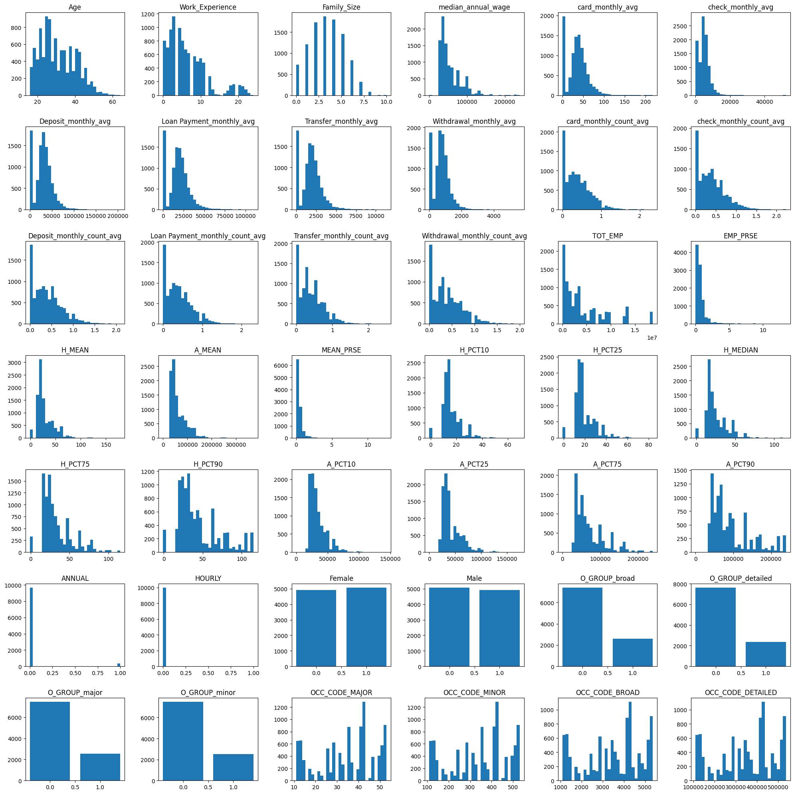

  The feature distribution analysis reveals that most numerical attributes are right-skewed, indicating a higher concentration of lower values across these metrics. The `gender` attribute shows a balanced distribution, suggesting an equal representation of genders in the dataset. The `ANNUAL` and `HOURLY` attributes predominantly have `False` values, reflecting a specific characteristic of the employment status in the data. The categories within the `O_GROUP` attribute are evenly distributed, showcasing a diverse occupational grouping in the dataset.
  
* **Correlation Analysis**
  
  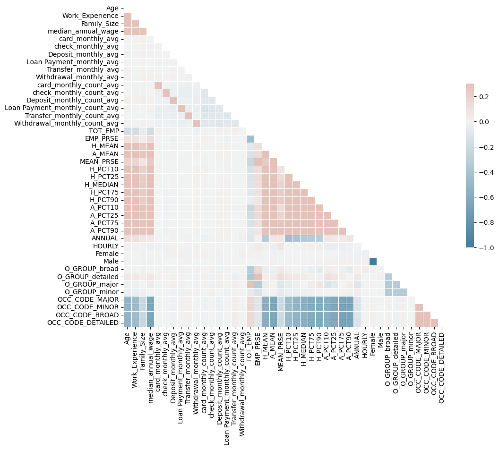

  The correlation analysis indicates a lack of strong correlations between the features, suggesting that the variables operate independently of each other, which is an important consideration for the subsequent clustering analysis.


#### Normalization and PCA
* **Normalization**
  
  Numerical features were normalized employing the `Normalizer` class from the `sklearn.preprocessing` module, ensuring that each feature contributes equally to the analysis.

* **Principal Component Analysis (PCA)**
  
  To reduce dimensionality and enhance the analytical framework, PCA was conducted using the `PCA` class from the `sklearn.decomposition` module. The optimal number of components was determined through the analysis of the `explained_variance_ratio_`, with the cumulative explained variance guiding the selection. This process identified 6 as the ideal number of principal components to retain, balancing data simplification and information preservation.

  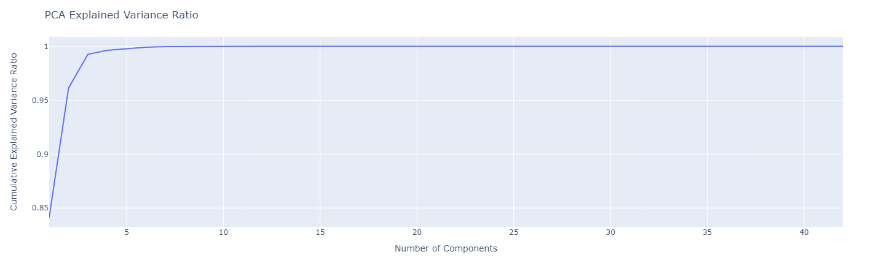


#### Customer Segmentation
Clustering analysis was executed using `K-Means`, `HDBSCAN`, and `OPTICS` algorithms. For K-Means, the Elbow Method determined the optimal cluster count, while Bayesian Optimization was employed to fine-tune the hyperparameters across all algorithms. The clustering effectiveness was assessed using the `Silhouette Score`, `Calinski-Harabasz Score`, and `Davies-Bouldin Score`. A composite score was calculated by normalizing and averaging these metrics. The final clustering visualization was created using the `TSNE` algorithm, with 3D plots generated via the `plotly` library.

##### Evaluation Metrics
###### Silhouette Score
Reflects an object's cohesion within its own cluster compared to other clusters, ranging from -1 to 1. A higher score indicates better fit to its own cluster and distinct separation from others.

###### Calinski-Harabasz Score
Measures the ratio of between-cluster variance to within-cluster variance, with higher values indicating more distinct clustering.

###### Davies-Bouldin Score
Assesses average similarity between each cluster and its closest cluster, where lower scores denote better separation quality.

###### Comprehensive Score
A composite metric was derived by normalizing and averaging the individual scores to provide an overall clustering effectiveness measure. The normalization and averaging process is as follows:

```python
# silhouette_score is between -1 and 1, the higher the better
silhouette_score_value = silhouette_score(X, clusters)
# normalize to 0-1
silhouette_score_value = (silhouette_score_value + 1) / 2

# calinski_harabasz_score is a index to evaluate the model, the higher the better, range is 0 to +inf
calinski_harabasz_score_value = calinski_harabasz_score(X, clusters)
# normalize to 0-1
calinski_harabasz_score_value = 1 - (1 / (1 + calinski_harabasz_score_value))

# davies_bouldin_score is a index to evaluate the model, the lower the better, range is 0 to 1
davies_bouldin_score_value = 1 - davies_bouldin_score(X, clusters)

# comprehensive score is the distance of the score to the best score, the lower the better, transform to higher the better and normalize to 0-1
comprehensive = (math.sqrt(3) - math.dist([silhouette_score_value, calinski_harabasz_score_value, davies_bouldin_score_value], [1, 1, 1])) / math.sqrt(3)
```

##### K-Means Clustering
The Elbow Method initially suggested that the optimal number of clusters for the K-Means algorithm was 4. However, upon further analysis using the `Silhouette Score`, `Calinski-Harabasz Score`, and `Davies-Bouldin Score`, the ideal number of clusters was revised to 2. Clustering analysis was thus performed with this optimal cluster count. Bayesian Optimization was subsequently applied to fine-tune the hyperparameters, leading to the identification of the best parameter set and scores for the K-Means algorithm.

```
best parameters: {'algorithm': 'lloyd', 'init': 'random', 'max_iter': 846, 'n_clusters': 2}
best accuracy: 0.6425655038115965
Silhouette Score: 0.708174092678777
Calinski Harabasz Score: 21611.258750327295
Davies Bouldin Score: 0.601654107448369
```

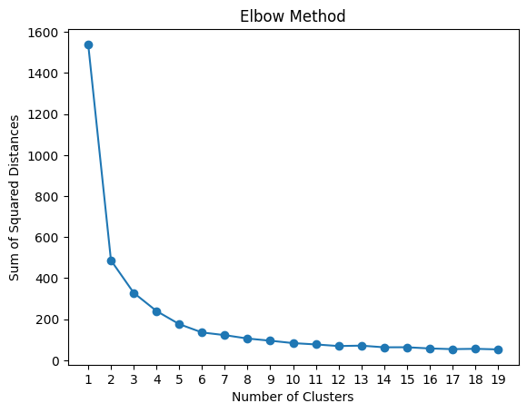 

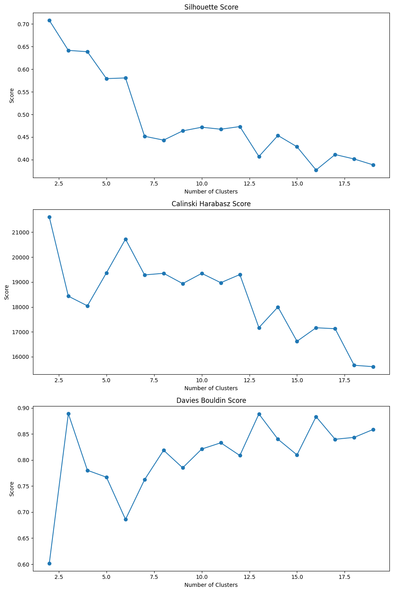

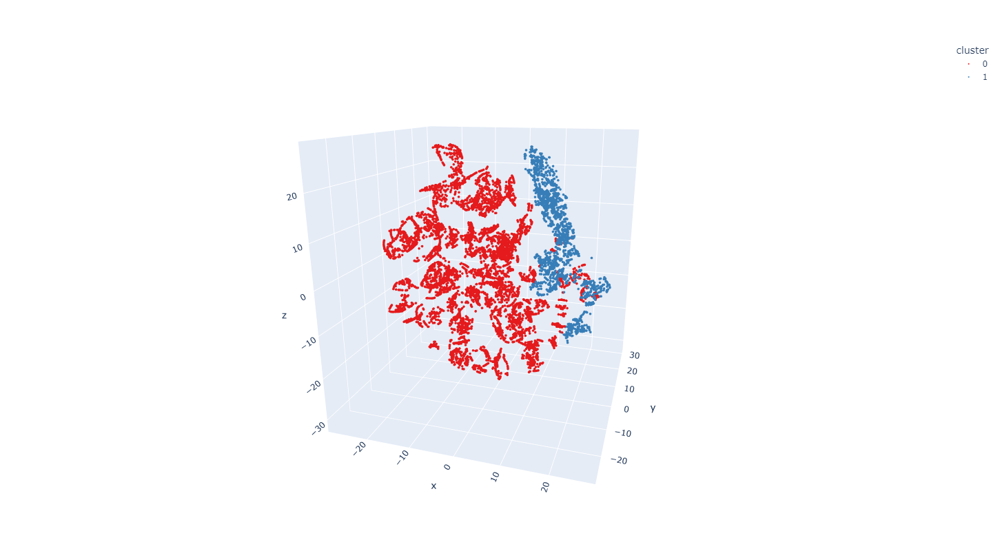

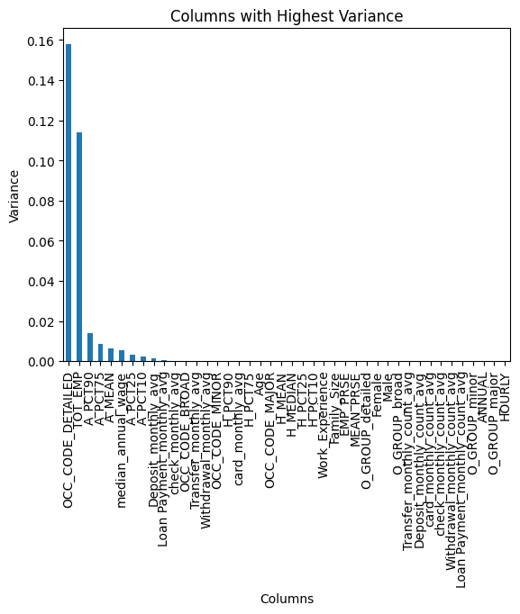

##### HDBSCAN Clustering
Clustering analysis utilizing the HDBSCAN algorithm was conducted, with Bayesian Optimization applied to determine the best hyperparameters and scores. The optimized results for the HDBSCAN algorithm are presented below:

```
best parameters: {'cluster_selection_method': 'eom', 'leaf_size': 82, 'max_cluster_size': 5650, 'metric': 'euclidean', 'min_cluster_size': 45, 'min_samples': 40}
best accuracy: 0.4083019161779855
Silhouette Score: 0.14080266086728108
Calinski Harabasz Score: 297.6289092294178
Davies Bouldin Score: 0.9304588313992345
Number of Clusters: 43
```
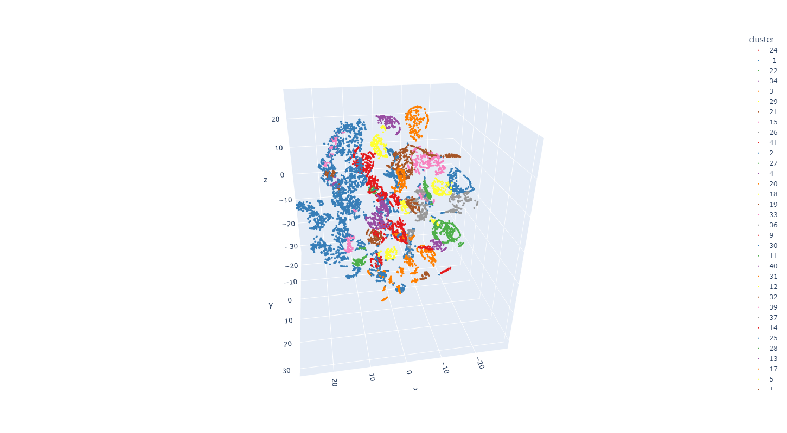

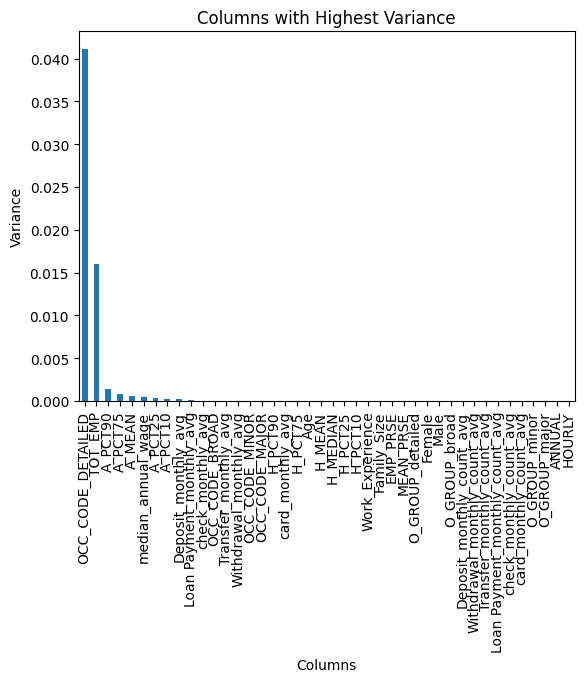

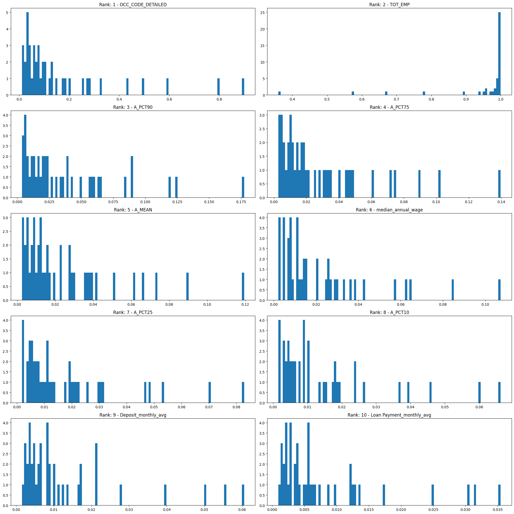


##### OPTICS Clustering
The OPTICS algorithm was employed for clustering analysis. Following the application of Bayesian Optimization, the optimal hyperparameters and performance scores for the OPTICS algorithm were identified. The details of these findings are as follows:


```
best parameters: {'cluster_method': 'xi', 'leaf_size': 63, 'metric': 'manhattan', 'min_cluster_size': 33, 'min_samples': 44, 'p': 1, 'predecessor_correction': True, 'xi': 0.09}
best accuracy: 0.3785897457611385
Silhouette Score: 0.03303687963185522
Calinski Harabasz Score: 156.02186096682343
Davies Bouldin Score: 0.9615909394748148
Number of Clusters: 33
```
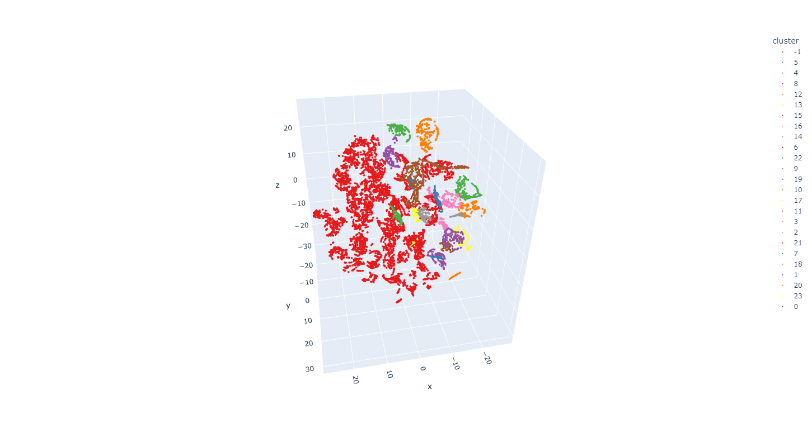

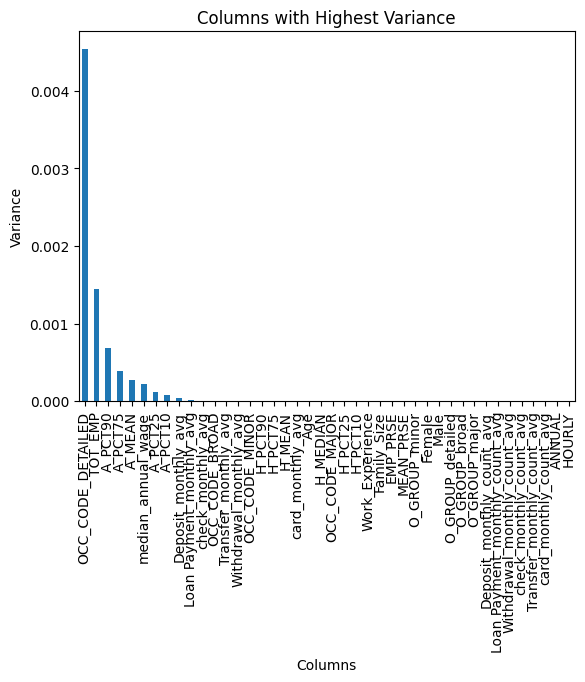

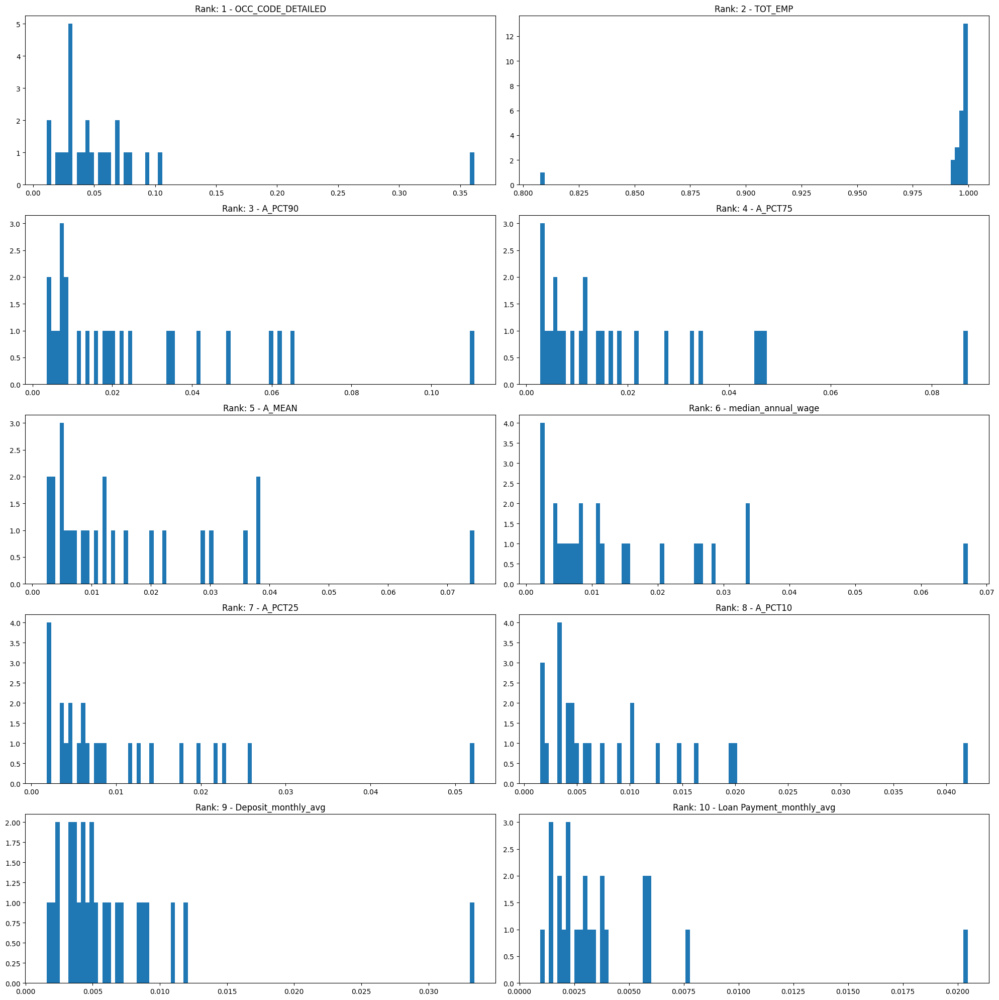


### Conclusion
#### Model Selection and Evaluation
The K-Means clustering model exhibited the highest score but identified only two clusters. A t-SNE visualization suggested the presence of subclusters. The HDBSCAN model produced 43 clusters, a significantly higher count with a comprehensive score lower than K-Means. However, it labeled around 3,000 data points as noise, indicating a balanced distribution across clusters. The OPTICS model, with 33 clusters, provided a more reasonable segmentation and balanced cluster distribution, despite its comprehensive score being slightly lower than K-Means. OPTICS outperformed in visualization clarity, leading to its selection as the final model due to its reasonable cluster count and superior visualization. Feature engineering further refined the model, improving score and reducing noise.

#### Feature Importance
Analysis of variance within clusters highlighted the top 10 features, primarily demographic data and transaction averages over a 30-day window for deposits and loan payments. These findings align with domain knowledge, underscoring the utility of feature importance in explaining clusters and aiding bank decision-making.

#### Future Work
Enhancements in feature engineering and model sophistication are pivotal for advanced customer segmentation. The transaction data's potential remains untapped, with opportunities to explore metrics like rolling window. Then the abnormal transaction amount which is greater than 3 times of the standard deviation can be detected. Besides feature engineering, the model can be improved by using the ensemble method. The ensemble method can combine the result of different clustering model and get a better result. The scoring method can be improved by developing a more comprehensive score.
